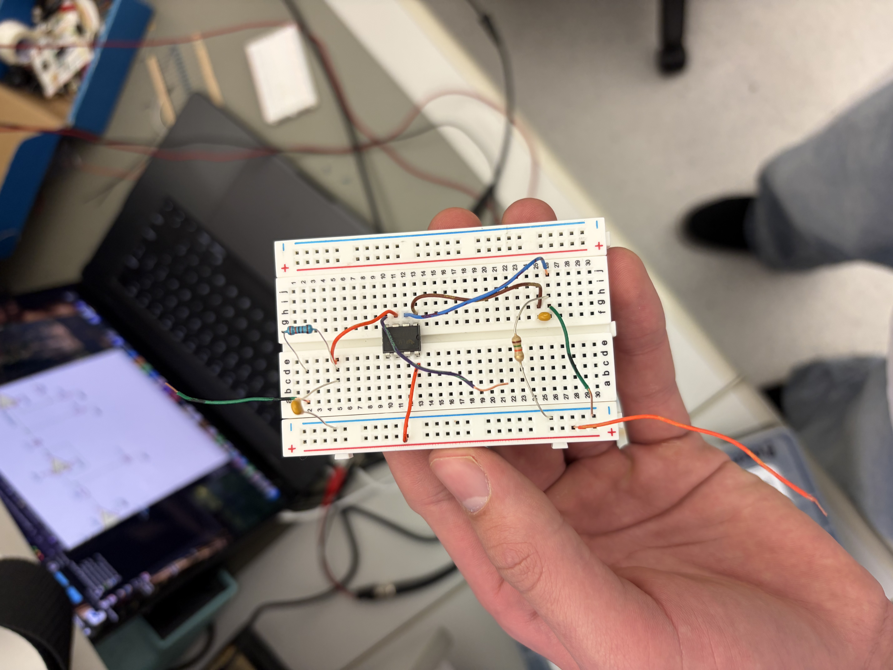
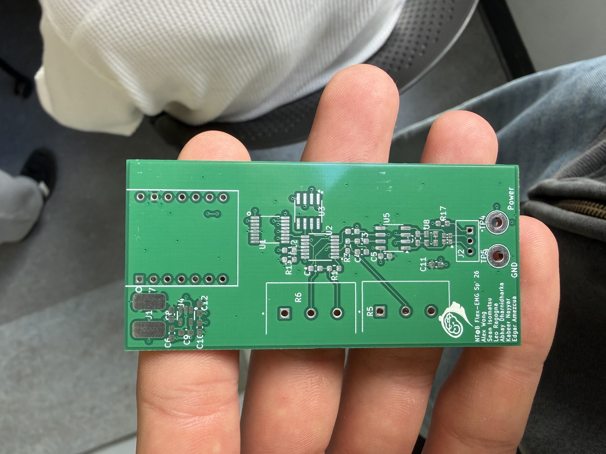

# Flex-EMG

A wearable surface-electromyography (sEMG) platform that reads muscle activity
from the forearm, cleans it with a real-time digital filter chain, and
classifies hand gestures using a lightweight machine-learning model.

The project spans the full stack: a custom analog front-end (AFE) PCB, ESP32
firmware that streams ADC samples over WiFi, and a Python backend that filters
the signal, recognizes gestures, and broadcasts results to any client over
WebSocket.

> Built by the **Neurotech at Berkeley** Flex-EMG team, Spring 2026.

---

## How it works

```
 Forearm muscles
       │  surface electrodes
       ▼
 Analog Front-End PCB ── instrumentation amp → filtering → 24-bit ADC
       │  digital samples
       ▼
 ESP32-C3 firmware ─────── streams {"v": <adc>} over WiFi / serial
       │
       ▼
 Python backend ────────── bandpass 20–500 Hz + 60 Hz notch
       │                   Hudgins features → LDA gesture classifier
       ▼
 WebSocket broadcast ───── live frames to dashboards / notebooks / viewers
```

Each processed frame is streamed as JSON:

```json
{ "ts": 1713456789.12, "raw": 1.65, "filtered": 0.042, "gesture": "Fist Squeeze", "confidence": 0.97 }
```

---

## Hardware

The custom AFE board conditions a microvolt-level EMG signal into a clean
digital stream:

- **ADS1220** — 24-bit delta-sigma ADC with integrated PGA
- **OPA4322** — quad precision op-amps for the analog filter / gain stages
- **MCP4141** — digital potentiometer for programmable gain
- **ESP32-C3** — onboard wireless MCU for sampling and streaming

KiCad source (schematic, layout, footprints, and BOM) lives in
[`finalKiCad/`](finalKiCad/).

### Gallery

| | |
|:---:|:---:|
| <br>**Breadboard prototype** of the front-end | <br>**Fabricated AFE board** fresh from the fab |
| <br>**Reflow + rework bench** used for assembly | <br>**Inspecting a board** under the microscope |
| <br>**Layout under the scope** during placement | <br>**Soldered ICs** — ADC and op-amp stages |

---

## Software

The backend lives in [`backend/`](backend/) and is fully documented in
[`backend/DOCS.md`](backend/DOCS.md). Key modules:

| Module | Role |
|--------|------|
| `config.py` | Single source of truth for sample rate, filter, and connection settings |
| `signal_processor.py` | Real-time bandpass + 60 Hz notch filter chain (SciPy SOS) |
| `esp32_client.py` | WiFi/serial reader with auto-reconnect |
| `classifier.py` | Hudgins time-domain features → StandardScaler + LDA pipeline |
| `server.py` | WebSocket server that fans frames out to all clients |
| `main.py` | Production entry point (`--train`, `--classify`) |
| `test.py` | Hardware-free simulator with a live viewer and training UI |

---

## Getting started

### 1. Simulation (no hardware required)

```bash
cd backend
pip install -r requirements.txt
python test.py          # live matplotlib viewer
python test.py --text   # terminal table mode
```

Hold `1` / `2` to record the two gesture classes, press `T` to train, then `P`
to toggle live prediction. See [`backend/DOCS.md`](backend/DOCS.md) for the full
key map.

### 2. Real hardware

1. Flash `backend/esp32_firmware/emg_sender.ino` to the ESP32 (edit the WiFi and
   backend host lines first).
2. Point `config.py` at your board:
   ```python
   ESP32_MODE   = "websocket"
   ESP32_WS_URI = "ws://<your-esp32-ip>:81"
   ```
3. Collect data and run live classification:
   ```bash
   python main.py --train      # guided data collection
   python main.py --classify   # stream gestures over ws://0.0.0.0:8765
   ```

---

## Repository layout

```
backend/        Python signal-processing + ML pipeline (see DOCS.md)
finalKiCad/     KiCad project: schematic, PCB layout, footprints, BOM
pics/           Project photos
```

---

## Team

Neurotech at Berkeley — Flex-EMG, Spring 2026:
Alex Wong · Sean Isomatsu · Leo Ragogna · Abhay Bharnidharka · Kabeer Nayyar · Edgar Amazcua
